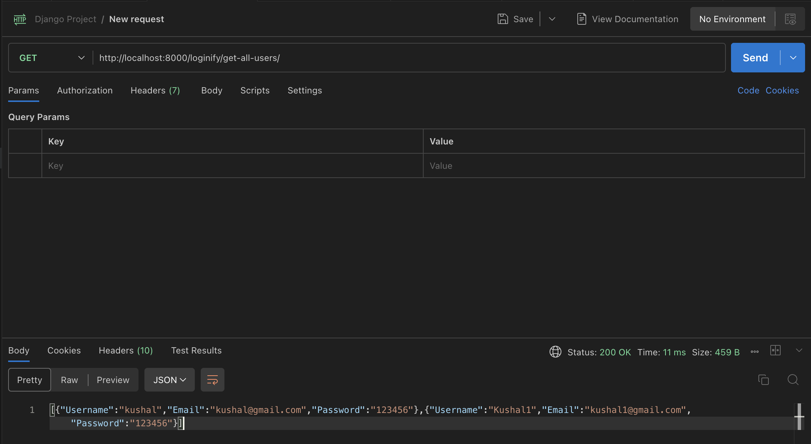
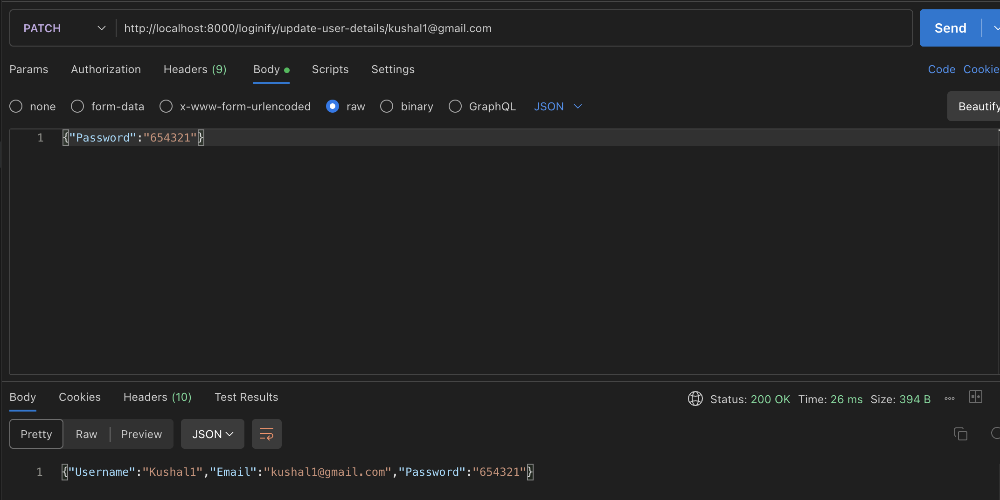
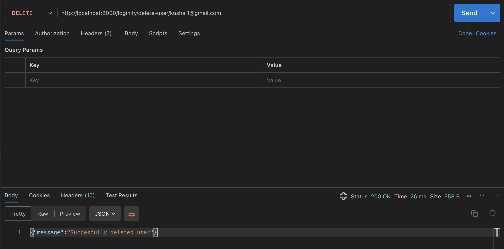

# Django Project

Django project created for practice.

## Installation

Create a virtual environment (MAC/Linux):

```bash
python3 -m venv DjangoAssignment
```

Activate the virtual environment:

```bash
source DjangoAssignment/bin/activate
```

Install requirements:

```bash
pip install -r requirements.txt
```

## Run
Navigate to LoginSystem directory : `cd LoginSystem`

Start server:
```bash
python manage.py runserver
```

## Available pages
**`{{api_url}}/loginify/signup`**:

Accepts username, email and password. Email must be unique. Cannot be accessed via postman due to CSRF block.

**`{{api_url}}/loginify/login`**:

Accepts email and password to login.

## Available end points

* **Hello World:**
    * **Method:** `GET`
    * **Endpoint:** `{{api_url}}/loginify/`
    * **Description:** Test end point that returns "Hello World".

* **Get All Users**
    * **Method:** `GET`
    * **Endpoint:** `{{api_url}}/loginify/get-all-users/`
    * **Description:** Retrieves a list of all registered users.
    * **Example Request:**
    

* **Get User Details by Email**
    * **Method:** `GET`
    * **Endpoint:** `{{api_url}}/loginify/get-user-by-email/{user_email}/`
    * **Description:** Retrieves the details of a specific user by their email.
    * **Example Request:**
    

* **Update User Details**
    * **Method:** `PUT` / `PATCH`
    * **Endpoint:** `{{api_url}}/loginify/update-user-details/{user_email}/`
    * **Description:** Updates one or more details for a specific user.
    * **Body (raw/json):**
        ```json
        {
            "password": "654321"
        }
        ```
    * **Example Request:**
    

* **Delete User**
    * **Method:** `DELETE`
    * **Endpoint:** `{{api_url}}/loginify/delete-user/{user_email}/`
    * **Description:** Deletes a specific user from the system.
    * **Example Request:**
    


